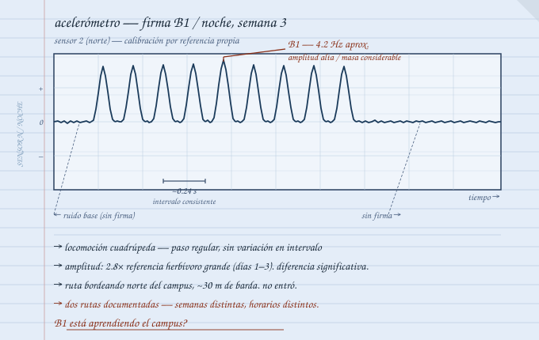

---
title: "Documento original 03"
---

> [!doc-ref] Archivo reconstruido
> [[personajes/carlos/cap-03|F-05 / Documento 003]]

---

Calibración: cuatro días.

Calibrar sin referencia conocida es un problema diferente al que el sistema fue diseñado para resolver. Lo resolví con referencias propias — yo caminando el perímetro mientras Guerrero monitoreaba la pantalla, un coche empujado despacio por el estacionamiento, Daniela saltando en distintos puntos del campo. Tabla de correlación entre masa aproximada, distancia y amplitud. Imprecisa pero mía.

Al cuarto día la tabla tenía suficientes puntos para ser útil.

Esa noche algo cruzó por el norte. Los cuatro sensores lo registraron con claridad.

---

Secuencia de menos de tres minutos. Picos en orden — noreste primero, luego norte, luego noroeste, segunda lectura noreste cuando completó el arco hacia el poniente.

Copié los tiempos en la libreta azul. Hice los cálculos.

Velocidad: paso regular de unos cuatro metros por zancada. No corría. Caminaba. Amplitud: más pesado que la firma del herbívoro grande que registré los primeros días en el campus — esa la tenía como referencia. Esto era más. Más lento. Intervalo entre pasos que sugería algo muy grande o algo muy deliberado, o ambas.

Código: B1. El que había usado desde el principio para la firma más grande.

En el mapa esquemático tracé la ruta — línea curva bordeando el norte del campus de oriente a poniente, a unos treinta metros de la barda.

No entró. Bordeó.

Territorial o ruta habitual. No sé cuál. Sé que la distinción importa.

---

Tres noches más de registro.

B1 volvió una vez. Ruta diferente — no el norte, el oriente. Dos líneas en el mapa que no se cruzan y no son paralelas.

Si fuera territorial las rutas serían más consistentes. Si fuera tránsito el horario sería más fijo. Dos rutas distintas en noches distintas con horarios variables sugiere exploración.

B1 está aprendiendo el campus.

Lo escribí con signo de interrogación al final. Tipo de conclusión que prefiero no escribir hasta estar seguro. Pero tampoco podía ignorarla.

---

Daniela hizo la pregunta correcta ese día mientras le explicaba el sistema.

Le explico todo a Daniela — hace preguntas útiles y explicar en voz alta me ayuda a encontrar huecos en mi propio razonamiento.

Preguntó para qué sirve saber por dónde se mueve.

Para saber por dónde no movernos nosotros. Y para saber si el patrón cambia — que es cuando hay que preocuparse de verdad.

Preguntó por qué cambiaría.

Porque algo lo hizo cambiar. Los animales modifican rutas cuando cambia algo en el entorno. Si B1 empieza a moverse diferente significa que algo cambió afuera que todavía no vemos.

Asintió con la expresión de alguien que va a usar esa distinción después. La reconozco de años de dar clases.

---

Esa noche B1 no apareció.

B2 al sur, breve. Algo al poniente, firma tan pequeña que podría haber sido animal común si los animales comunes todavía existieran igual que antes.

Esperé hasta pasada la medianoche. Cerré la libreta azul.

  

    ● REC
    NOTA DE CAMPO 03 — F-05
    Para cuando aparezcan / carpeta de audio
  

  

    <audio controls src="/static/audio/carlos/nota-campo-03.mp4" type="audio/mp4"></audio>
    
// señal recuperada — interferencia parcial

  

  

    
// ver transcripción

    

      
Nota de voz — Carlos / Semana 3, noche

      
"Cinco días de datos. B1 tiene dos rutas documentadas, ninguna entra al campus, ambas bordean a distancia consistente. Bueno. Por ahora.

      
Lo que me preocupa es lo que Daniela preguntó hoy sin saber que me estaba preguntando algo importante. La respuesta honesta es que el sistema sirve hasta que deja de servir. Hasta que el patrón cambia.

      
Espero que no cambie pronto.

      
Esta noche nada. No sé si B1 tomó una ruta que los sensores no cubren o simplemente no pasó. Cuatro sensores en un solo edificio tienen ángulos muertos. Necesito más cobertura. Problema para cuando tenga ayuda para instalarlo de noche. Que no es hoy.

      
Intenté mandar audio al grupo. Al grupo de voz directo. Se quedó cargando. Lo intenté de todas formas porque días así dan ganas de escuchar a alguien conocido decir algo estúpido.

      
Hubiera sido bueno.

      
Buenas noches."

    

  

