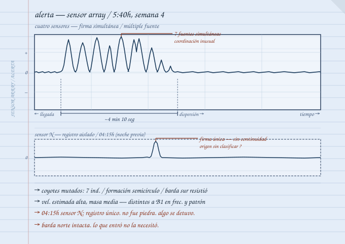
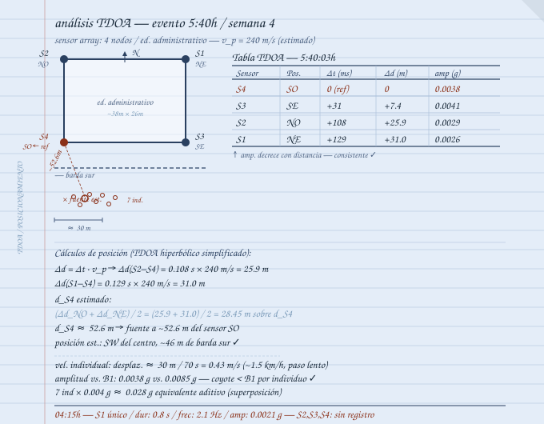
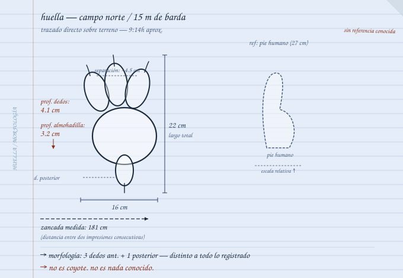
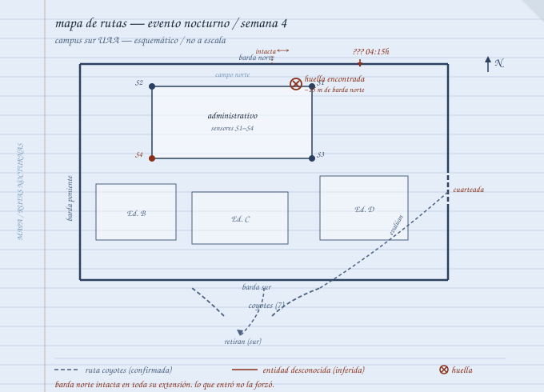
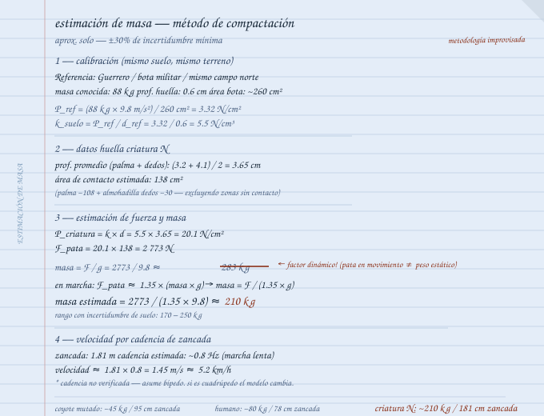

---
title: "Documento original 04"
---

*Señal Muerta — Crónicas de la Emergencia* / *Carlos — Entrada 04*
**Archivo reconstruido:** [[personajes/carlos/cap-04|F-05 / Documento 004]]

---

Alerta a las 5:40 de la mañana.

Llevaba una hora despierto — el cuerpo me saca del sueño antes del amanecer con una puntualidad que ningún despertador logró nunca. Revisaba los registros nocturnos cuando las cuatro líneas saltaron al mismo tiempo.

No era B1. Amplitud diferente — más alta en frecuencia, menos masa, múltiples fuentes simultáneas. Conté los focos.

Cinco. Seis. Siete.

Zapatos sin sentarme. Libreta azul. Corredor.

---

Guerrero en el cuarto contiguo — arreglo desde la primera semana, los dos más cerca del sistema que el resto del campus. Toqué dos veces. El código.

Abrió en menos de diez segundos. Años de mantenimiento universitario donde los problemas no respetan horarios. Se nota en cómo despierta.

Sur. Múltiples. Todavía fuera de la barda según la amplitud pero acercándose.

Segundo piso. Cielo todavía en gris previo al amanecer.

Siete fuentes activas. Dirección norte hacia la barda sur. Velocidad consistente con coyote grande. Si la barda los detiene, suficiente tiempo. Si no los detiene —

No terminé. Guerrero ya entendía.

---

Despertar a todo el campus era la respuesta obvia y era la equivocada. Treinta personas en la oscuridad producen ruido, movimiento, pánico, variables que no puedo controlar.

Guerrero, Daniela, dos estudiantes más. Cuatro. Suficiente para cubrir los puntos críticos.

Corredor en voz baja: actividad al sur, probablemente Coyotes Mutados, probablemente la barda los detiene. Nadie sale, nadie hace ruido, todos reportan lo que ven.

Uno preguntó qué hacemos si entran.

Si entran nos quedamos adentro hasta que se vayan. No buscan edificios, buscan territorio abierto.

Era hipótesis. La dije con suficiente convicción para que funcionara como instrucción.

---

Los coyotes llegaron cuatro minutos después.

Siete confirmados. Más grandes que los tres de dos semanas atrás. La coordinación ya no era manada — era otra cosa. Dos llegaron a la barda y la olieron. Los otros cinco en semicírculo detrás, cabezas bajas, orejas rotando de forma independiente.

Escuchando.

Uno encontró la sección cuarteada del oriente. La olió. Se alejó y volvió con los otros. Intercambio que no supe leer — movimiento de cabezas, contacto físico breve entre dos de ellos.

Luego se fueron. Misma formación. Hacia el sur.

En dos minutos el campo estaba vacío.

Anoté hora, duración, número, comportamiento en la barda. Respondí preguntas con la misma economía de siempre. Sí, se fueron. No, no entraron. Sí, el sistema funcionó.

---

Resto de la mañana revisando registros de la noche completa.

B2 activo al oriente entre las 2 y las 3 — firma pequeña, trayectoria errática, sin justificación para despertar a nadie pero suficiente para añadir al mapa.

Y algo más. Casi no aparecía en el registro — pulso único, amplitud media, sensor norte, 4:15 de la mañana.

Una sola lectura. Sin secuencia. Sin movimiento sostenido.

Una piedra cayendo. Vibración residual. Error del sensor.

O algo que se detuvo junto a la barda norte un momento y se fue tan rápido que el sensor apenas lo registró.

Lo anoté con signo de interrogación. Seguí.

---

Esa tarde Guerrero encontró las huellas.

Campo norte. Adentro. A quince metros de la barda. Cuatro impresiones en el pasto, profundas. Separación equivalente a zancada de metro ochenta.

No era coyote.

Tres dedos adelante, uno atrás. Morfología sin referencia. La barda norte intacta — sin daño, sin sección cuarteada.

Lo que entró no necesitó forzarla.

Fotografié las huellas desde todos los ángulos. Las medí. Las describí con más detalle del que normalmente uso porque el detalle era lo único que podía controlar en ese momento.

Luego me quedé parado en el campo norte mirando la barda durante un buen rato.

  <figure class="photo-item">
    
    <figcaption>Registro — sensor array / 5:40h</figcaption>
  </figure>
  <figure class="photo-item">
    
    <figcaption>Análisis TDOA / posicionamiento</figcaption>
  </figure>
  <figure class="photo-item">
    
    <figcaption>Huella / morfología — campo norte</figcaption>
  </figure>
  <figure class="photo-item">
    
    <figcaption>Mapa rutas nocturnas / semana 4</figcaption>
  </figure>
  <figure class="photo-item">
    
    <figcaption>Estimación masa / método compactación</figcaption>
  </figure>

  

    ● REC
    NOTA DE CAMPO 04 — F-05
    Para cuando aparezcan / carpeta de audio
  

  

    <audio controls src="/static/audio/carlos/nota-campo-04.mp4" type="audio/mp4"></audio>
    
// señal recuperada — interferencia parcial

  

  

    
// ver transcripción

    

      
Nota de voz — Carlos / Semana 3, tarde

      
"El sistema funcionó esta mañana. Cuatro minutos de ventaja antes de que llegaran a la barda. Exactamente para lo que lo construí.

      
Ahora la parte menos bien.

      
Huellas en el campo norte. Adentro. De algo que no es coyote. Según el registro entró y salió entre las 4 y las 4:30 sin que los sensores lo detectaran bien — menos de un minuto aquí.

      
Un minuto es suficiente para muchas cosas.

      
No sé qué es. No sé cómo entró. No sé si ya había entrado antes y simplemente no teníamos los sensores para saberlo. Esa última es la posibilidad que menos me gusta.

      
La barda norte está intacta. No la forzó.

      
Saltó, o encontró una manera que no identifiqué todavía. Cualquiera de las dos es peor que la otra dependiendo del día.

      
Cuando encontré las huellas lo primero que pensé fue que ojalá estuviera Aarón aquí. Él hubiera sabido leerlas mejor — mecánica, proporciones, distribución de peso. Yo veo una huella y anoto lo que veo. Él vería cómo funciona lo que la hizo.

      
En fin.

      
Esta noche no le cuento a Guerrero. Ya tuvo suficiente. Los dos tuvimos suficiente.

      
Buenas noches, supongo."

    

  

