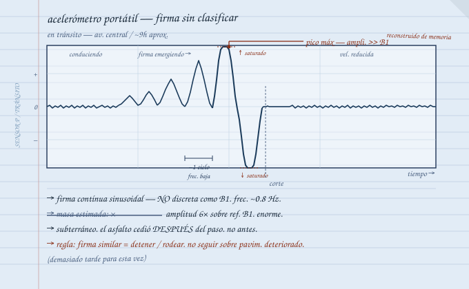

*Señal Muerta — Crónicas de la Emergencia* / *Carlos — Entrada 05*

---

Semanas más. Perdí la cuenta exacta.

La gente encontró sus propios ritmos. Dejaron de preguntarme todo. Esa fue la señal.

Les dije la noche anterior que me iba. Sin drama. Dejé instrucciones documentadas para el sistema de sensores — tres páginas en la libreta azul de repuesto. Suficiente para que alguien más lo opere.

Mañana de salida: acelerómetro portátil, tablet, cable, libreta azul principal, baterías, herramientas básicas, comida para días, agua. Coche cargado hasta donde tenía sentido cargar.

Nadie hizo gran cosa del momento. Así debía ser.

---

Campus sur a centro — normalmente veinte minutos. Sin referencia útil de cuánto tomaría ahora.

Primeros kilómetros sin incidente. Coches abandonados en los carriles pero espacio para rodear. El acelerómetro en el asiento del copiloto conectado a la tablet — idea de último momento antes de salir.

Registró desde el primer semáforo.

Firmas pequeñas y dispersas — B2 o B3 según mis códigos. Lo interesante era la distribución: ciertos bloques con actividad constante, otros en silencio total. La ciudad tiene una geografía nueva que el mapa no muestra. Anoté lo que pude sin dejar de manejar.

---

Firma nueva en la tablet. Frecuencia más baja, amplitud creciente, ritmo que no correspondía a ningún código anterior. Algo debajo de la avenida moviéndose en mi dirección.

Reduje velocidad.

Pico en la tablet. Frené.

El asfalto frente al coche cedió en secuencia — grietas radiales desde un punto central, pavimento levantándose en los bordes, hundimiento oscuro en el centro. Del hundimiento emergió el cuerpo — negro, betuminoso, segmentado en anillos, más grueso de lo esperado. Del grosor de un poste de luz. La superficie brillaba exactamente como asfalto fundido bajo el sol directo.

Tres, cuatro metros visibles. Luego de vuelta hacia el sur.

Me quedé en el coche con el motor encendido.

Rodeé por calle lateral. La firma siguió paralela dos cuadras más antes de perderse.

---

Cuatro cuadras después la llanta trasera derecha cayó.

No un bache — caída. Vacío donde debería haber asfalto. El coche se inclinó, golpe de suspensión, raspado de carrocería contra el borde del hundimiento. Detenido en diagonal, parte trasera dentro del cráter.

Motor encendido. Llantas girando sin tracción.

Motor apagado.

Hundimiento: metro y medio en el punto más bajo, borde irregular, carrocería trasera descansando en concreto roto. No iba a salir solo. No tenía con quién.

---

Inventario de lo que podía cargar a pie:

Acelerómetro portátil — sí

Tablet — sí

Libreta azul — sí

Baterías y cable — selección mínima

Herramientas — las más pequeñas

Comida y agua — lo que cupiera

El resto se quedó en el coche.

Cargué la mochila. Tomé el acelerómetro. Miré el coche encajado en el cráter.

Seis años de pagos. Pero eso era antes.

Seguí.

  

    ● REC
    NOTA DE CAMPO 05 — F-05
    Para cuando aparezcan / carpeta de audio
  

  

    <audio controls src="/static/audio/carlos/nota-campo-05.mp4" type="audio/mp4"></audio>
    
// señal recuperada — interferencia parcial

  

  

    
// ver transcripción

    

      
Nota de voz — Carlos / En camino, tarde

      
"Vi al <a href="/bestiario/gusano-de-asfalto">Gusano</a>. De cerca. Más grande de lo que esperaba — tenía la firma registrada desde semanas atrás pero una cosa es el acelerómetro y otra cosa es verlo. Color exactamente como asfalto mojado. Segmentado. Más grueso de lo que la amplitud de la firma sugería.

      
El túnel residual fue lo que me sacó del coche. No lo vi. Nadie lo ve hasta que ya cayó.

      
Regla operativa: después de firma o avistamiento de Gusano, no continuar por la misma avenida. Rodear mínimo dos cuadras. Velocidad reducida en cualquier asfalto con deterioro visible.

      
Demasiado tarde para mí.

      
Estoy a unas cuadras del centro caminando. Mochila, acelerómetro, libreta azul. Lo esencial.

      
Fabián — si escuchas esto antes que los demás, el sistema de detección funciona en movimiento. La firma del Gusano es inconfundible en el acelerómetro portátil, te lo explico cuando nos veamos. Trae algo para anotar."

    

  

